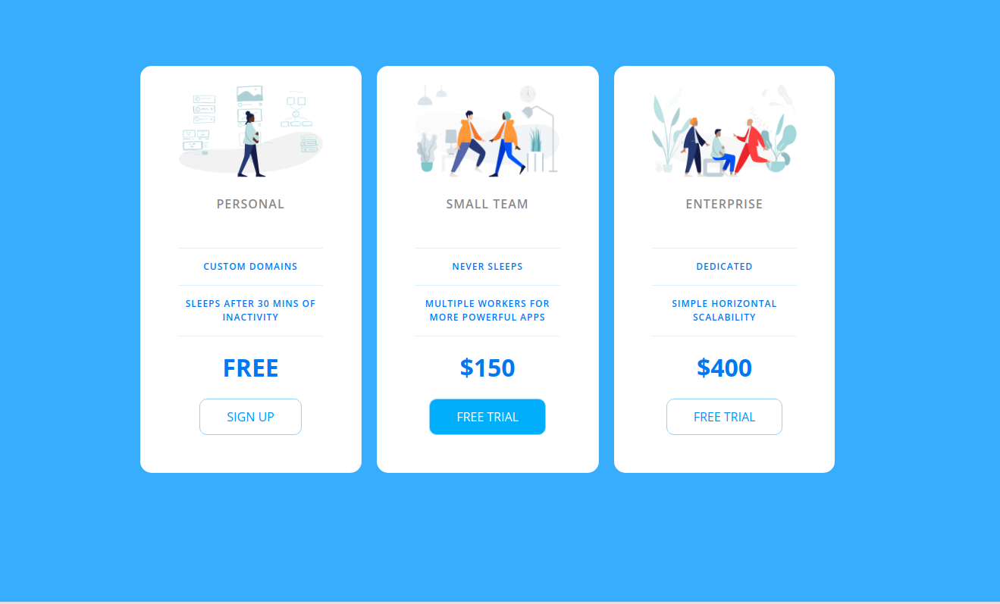

Adding all the projects to a single repository. The projects are from the
Udemy course - Web Developer Bootcamp 2020, old and updated projects.

------------------------------------------------------------------------------------------
patatap-clone

Patatap clone - A web app created with NodeJs, express, HTML+CSS, Paper.JS and Howler. Just fire up the website and start hitting letters on your keyboard and see the magic. The original website is hosted with the same name. I have tried to copy one instance of it and learnt it from the Web Developer Couse

The working link for this website hosted on heroku is : https://patatap-clone-sreeram.herokuapp.com/
Instructions: Open the link and smash your keyboard letters xD. 
------------------------------------------------------------------------------------------
pricing-panel CSS

Simple responsive pricing panel using CSS.

------------------------------------------------------------------------------------------
